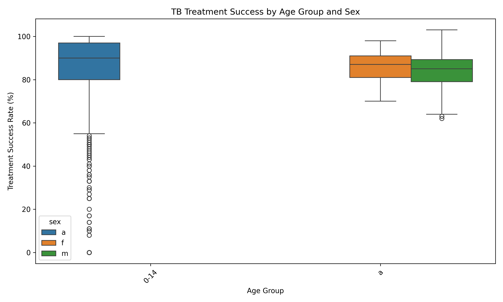
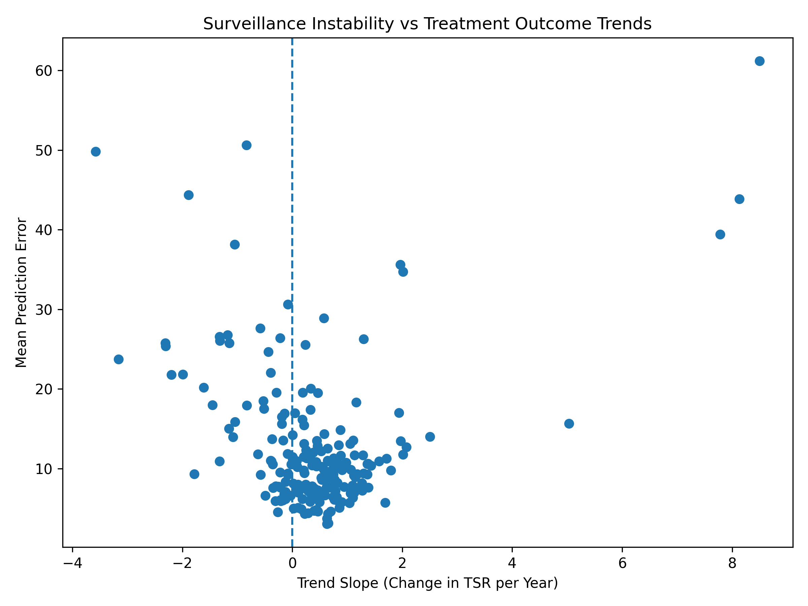

# tb-treatment-surveillance-analysis
Exploratory analysis of WHO tuberculosis treatment outcome surveillance data
# Tuberculosis Treatment Outcome Surveillance Analysis

This repository contains an independent, exploratory analysis of publicly available World Health Organization (WHO) tuberculosis treatment outcome data. The project examines whether global improvements in treatment success rates obscure countries and populations where progress has stalled or where reported outcomes exhibit instability over time.

## Motivation
Global tuberculosis surveillance often relies on aggregate treatment success indicators. While useful for monitoring overall progress, such averages may conceal heterogeneity across countries and demographic groups. This project explores alternative ways of interpreting temporal trends and reporting variability in treatment outcomes.

## Data Sources
- WHO Tuberculosis treatment outcomes dataset (country-level, new and relapse cases)
- WHO age- and sex-disaggregated treatment outcomes dataset

All data used are publicly available and were accessed directly from the WHO Global Tuberculosis Programme.

## Methods
- Temporal trend analysis of treatment success rates at the country level
- Identification of countries with stagnant or declining long-term trends
- Simple linear modeling of treatment success over time
- Interpretation of model prediction error as a proxy for surveillance instability rather than predictive performance
- Descriptive analysis of age- and sex-based disparities in treatment success

No individual-level data or causal inference methods were used.

## Key Observations
- Global averages mask substantial variation in country-level treatment success trends
- Several countries exhibit limited improvement despite overall global progress
- Some countries show unstable reporting patterns that may complicate outcome monitoring
- Treatment success varies across age and sex groups at the population level

## Limitations
- Ecological (country-level) analysis
- Reliance on reported surveillance data
- No inference of causality or individual patient outcomes
- Reporting practices may vary across countries and time

## Purpose
This project was conducted as a self-directed learning exercise to develop skills in infectious disease surveillance analysis and to demonstrate independent research thinking for graduate-level training.

## Author
Samuel Aggrey
## Figures

### Figure 1. Global tuberculosis treatment success trend

*Average treatment success rate for new and relapse TB cases aggregated across reporting countries. While the global trend suggests gradual improvement, this representation conceals substantial country-level heterogeneity.*

---

### Figure 2. Age- and sex-based disparities in treatment success

*Distribution of treatment success rates stratified by age group and sex. The figure highlights persistent demographic differences in reported outcomes at the population level.*

---

### Figure 3. Surveillance instability versus treatment outcome trends

*Relationship between long-term country-level treatment success trends and mean model prediction error. Countries with limited improvement and high instability may represent areas where outcome monitoring is more challenging using aggregate indicators.*
